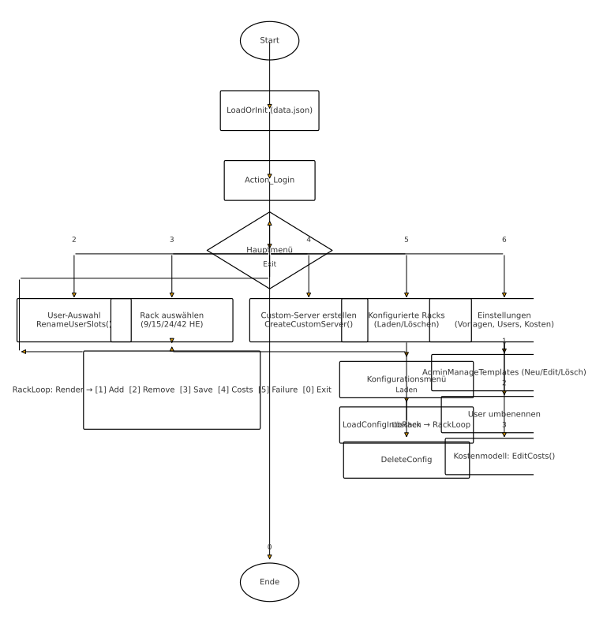
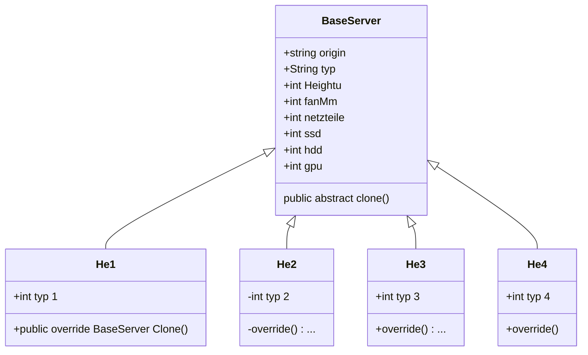
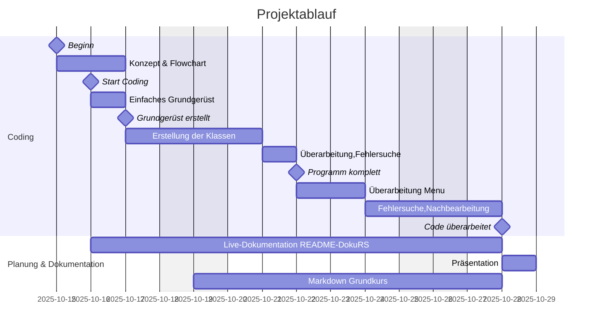
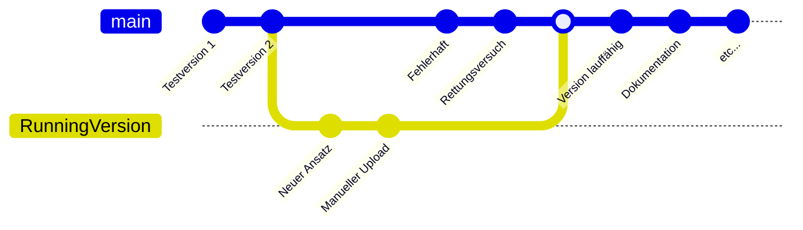

# Projektdokumentation – *ServerRackSimulator* (C# Konsole)

> - **Lehrgang:** Fachinformatiker/25-3
> - **Autor:** Vieregg, Patrick 
> - **Betreuer/Dozent:** Hr Lutz & Hr Hafner
> - **Datum:** 18.10.2025
> - **Version:** 1.1 

---

## 1. Management Summary (Kurzfassung)

**Ziel:** Ein Konsolen-POC zur Konfiguration von 19"-Racks (9/15/24/42 HE), Befüllen mit 1–4 HE-Server-Einschüben und einfacher **Kosten-/Ausfallrechnung**.\
**Ergebnis in Kürze:** Nutzer-/Rollenverwaltung (Admin/User), JSON-Persistenz, Vererbungsmodell (BaseServer → He1..He4), erster-freier-Slot-Einbau, Kostenmodell anpassbar.

---

## 2. Ausgangssituation & Zielsetzung

<details>
<summary><ins>Projektantrag</ins> </summary>

   
</details>

- **Ausgangssituation:** Lernprojekt (Anwendungsentwicklung Grundlagen), Grundlagen in Schleifen, Klassen, Konstruktoren und einfacher Vererbung. 
- **Projektziel:** Funktionsfähiger Proof-of-Concept zur Rack-Konfiguration inkl. Kostenübersicht und Ausfall-Simulation.

### 2.1 Stand-Up Meeting Zusammenfassung

| Datum      | Vortag                              | Geplant für Heute                                                                 | Probleme                                                                 |
|------------|-------------------------------------|------------------------------------------------------------------------------------|--------------------------------------------------------------------------|
| 16.10.2025 | Keine (erster Projekttag)           | Flowchart-Diagramm des Grundkonzepts<br>Erste Klassen und Menu-Tests<br>Tagesplanung und Ki-Zeitschätzung | Keine (erster Projekttag)                                                |
| 17.10.2025 | Flowchart abgeschlossen<br>Vererbung der HE-Server von `Baseserver` | Menu-Stil von der Übungsaufgabe `ToDo Manager`<br>Json Dateien angelegt, und testweise beschrieben | Code der Ausgabe und der `back`-Funktion<br>überarbeitet und neu konzeptioniert |
| 20.10.2025 | Anzahl `User`auf 3 gesetzt, sowie ein `admin`.<br>Vererbung finalisiert und Dokumentation<br> in markdown begleitend begonnen | Weitere Versuche zur Darstellung von Menu<br>und Ausgabe der in `json` angelegten Daten | Wiederholende Codeblöcke im Menu<br>und Headerbereich überarbeitet      |
| 24.10.2025 | Neue `RobCo` Klasse, aktuelle Flowchart<br> und `mermaid` Diagramme in .md erstellt | Überarbeitung vom `json` Speichersystem und<br> Menu auf Pfeiltastensteuerung.     | Fehlersuche im Code, sowie Githubunordnung<br>durch "Anfänger"Fehler     |
| 27.10.2025 | `Markdown` und `mermaid` Skillset vertieft und<br>die Dokumentaion überarbeitet.<br> Neue Branch `runningVersion` angelegt und<br>mit `main` gemerged. | Weitere Fehlersuche, kleinere Überarbeitungen,<br>sowie Codepflege durch <br>`Chat GPT-5`*Thinkingmode* | Wie am 24.10.2025 inklusive Branchmerge<br>und Github Struktur überarbeiten |

<details>
<summary><ins>Flowchart0.1</ins> </summary>

   
</details>

<details>
<summary><ins>Finale Flowchart *Chat GPT*</ins> </summary>

   
</details>

---

## 3. Anforderungen

### 3.1 Muss-Kriterien

- Racks in 9/15/24/42 HE auswählbar.
- Einsätze 1–4 HE mit Attributen (Typ, Lüftergröße/-anzahl, Netzteile, SSD/HDD, GPU, Herkunft „b / c“).
- Admin-Templates (b) & User-Customs (c) verwalten.
- Konfiguration speichern/laden (JSON).
- Kostenübersicht gesamt & je Einschub.

### 3.2 Soll-/Kann-Kriterien

- Umbenennung der drei Userslots. **Todo**
- Übersichtlich formatierte Rack-Darstellung.
- Ausfall-Simulation inkl. Ersatzteilkosten. **TODO**
### 3.3 Abnahmekriterien 

- **Anlegen** von Einsätzen und **Löschen** per #ID funktioniert.
- **Persistenz**: Nach Neustart sind Templates & Konfigurationen vorhanden.
- **Kostenanzeige** liefert Summe & Einzelpreise.
- **Ausfallrechnung** berechnet korrekte Ersatzteilkosten.

---

## 4. Systemübersicht

- **Benutzer & Rollen:** *Admin* (Vorlagen verwalten), *User* (nutzen, umbenennen möglich). **TODO**
- **Laufzeitumgebung:** .NET 8 (oder 7) Console, Windows/Linux.
- **Persistenz:** Eine Datei `data.json` im Programmverzeichnis.
- **Kontext:** Standalone-Konsolenanwendung; keine Netzwerkanbindung.
- **Annahmen:** HE-Logik: fortlaufende Slots 1..N; erster passender freier Slot wird belegt.

```
[Benutzer] ──(Konsole)──> ServerRackSimulator ──(JSON)──> data.json
```

---

## 5. Architektur & Design

### 5.1 Projektstruktur (Dateien)

- `Program.cs` – Menü-Loop, Aktionen (Login, Rack, Kosten, Ausfall), Speichern/Laden
- `Data/AppData.cs` – zentrale Daten (Users, Templates, Configs, Costs), Darstellung
- `Models/Users.cs` – `User`, `Role`
- `Models/Rack.cs` – `Rack`, `PlacedItem`, `RackConfig`, Rendering
- `Models/Servers.cs` – `BaseServer` → `He1..He4`, `BaseServerDTO`
- `Models/Costs.cs` – `CostSettings`, `CostModel`

### 5.2 Design-Entscheidungen

- **Vererbung:** HE-spezifische Typen erben von `BaseServer` als Diagramm:

Und in C#, `servers.cs`:
```C#
using System;

namespace ServerRackSimulator
{
    internal abstract class BaseServer
    {
        public Guid Id = Guid.NewGuid();
        public string Typ;
        public int HeightU;      // 1..4
        public int FanMm;        // 40/60/80/120 (abhängig von HE)
        public int FanCount;     // 4..8
        public int Netzteile;    // 1..3
        public int SSD;          // 0..4
        public int HDD;          // 0..24
        public int GPU;          // 0..8
        public string Origin;    // "b"=Base(Admin), "c"=Custom(User)

        public BaseServer() { }
        public BaseServer(string typ, int heightU, int fanMm, int fanCount, int netzteile, int ssd, int hdd, int gpu, string origin)
        {
            Typ = typ; HeightU = heightU; FanMm = fanMm; FanCount = fanCount; Netzteile = netzteile; SSD = ssd; HDD = hdd; GPU = gpu; Origin = origin;
        }
        public abstract BaseServer Clone();
    }

    internal class He1 : BaseServer
    {
        public He1() { }
        public He1(string typ, int fanMm, int fanCount, int netzteile, int ssd, int hdd, int gpu, string origin)
            : base(typ, 1, fanMm, fanCount, netzteile, ssd, hdd, gpu, origin) { }
        public override BaseServer Clone() { return new He1(Typ, FanMm, FanCount, Netzteile, SSD, HDD, GPU, Origin); }
    }
    internal class He2 : BaseServer
    {
        public He2() { }
        public He2(string typ, int fanMm, int fanCount, int netzteile, int ssd, int hdd, int gpu, string origin)
            : base(typ, 2, fanMm, fanCount, netzteile, ssd, hdd, gpu, origin) { }
        public override BaseServer Clone() { return new He2(Typ, FanMm, FanCount, Netzteile, SSD, HDD, GPU, Origin); }
    }
    internal class He3 : BaseServer
    {
        public He3() { }
        public He3(string typ, int fanMm, int fanCount, int netzteile, int ssd, int hdd, int gpu, string origin)
            : base(typ, 3, fanMm, fanCount, netzteile, ssd, hdd, gpu, origin) { }
        public override BaseServer Clone() { return new He3(Typ, FanMm, FanCount, Netzteile, SSD, HDD, GPU, Origin); }
    }
    internal class He4 : BaseServer
    {
        public He4() { }
        public He4(string typ, int fanMm, int fanCount, int netzteile, int ssd, int hdd, int gpu, string origin)
            : base(typ, 4, fanMm, fanCount, netzteile, ssd, hdd, gpu, origin) { }
        public override BaseServer Clone() { return new He4(Typ, FanMm, FanCount, Netzteile, SSD, HDD, GPU, Origin); }
    }

    internal class BaseServerDTO
    {
        public string Typ;
        public int HeightU;
        public int FanMm;
        public int FanCount;
        public int Netzteile;
        public int SSD;
        public int HDD;
        public int GPU;
        public string Origin;

        public static BaseServerDTO FromServer(BaseServer s)
        {
            BaseServerDTO d = new BaseServerDTO();
            d.Typ = s.Typ; d.HeightU = s.HeightU; d.FanMm = s.FanMm; d.FanCount = s.FanCount; d.Netzteile = s.Netzteile; d.SSD = s.SSD; d.HDD = s.HDD; d.GPU = s.GPU; d.Origin = s.Origin;
            return d;
        }

        public BaseServer ToServer()
        {
            if (HeightU == 1) return new He1(Typ, FanMm, FanCount, Netzteile, SSD, HDD, GPU, Origin);
            if (HeightU == 2) return new He2(Typ, FanMm, FanCount, Netzteile, SSD, HDD, GPU, Origin);
            if (HeightU == 3) return new He3(Typ, FanMm, FanCount, Netzteile, SSD, HDD, GPU, Origin);
            return new He4(Typ, FanMm, FanCount, Netzteile, SSD, HDD, GPU, Origin);
        }
    }
}

```
#### 5.2.1 Speichersystem `json` mit Data Transfer Object (DTO)
- Ein DTO ist ein Entwurfsmuster, das verwendet wird, um Daten zwischen verschiedenen Schichten einer Anwendung oder zwischen verschiedenen Systemen zu übertragen.<br>In diesem Szenario übernommen von `Chat GPT 5` nach Vorschlag und Erklärung:<br>
Da `BaseServer` abstrakt ist (Unterklassen He1..He4), wird für die Persistenz ein DTO eingesetzt, das nur primitive Felder enthält. Beim Laden wird aus dem DTO wieder die konkrete Klasse erzeugt.
```C#
// AppData: Wurzelobjekt der JSON-Datei
internal class AppData
{
    public List<User> Users = new List<User>();
    public List<BaseServer> ServerTemplates = new List<BaseServer>(); // „b“=Base, „c“=Custom
    public List<RackConfig> Configurations = new List<RackConfig>();
    public CostSettings Costs = CostSettings.CreateDefaults();
}

// Abstrakt + Unterklassen (gekürzt)
internal abstract class BaseServer
{
    public string Typ;
    public int HeightU, FanMm, FanCount, Netzteile, SSD, HDD, GPU;
    public string Origin; // „b“ oder „c“
    public abstract BaseServer Clone();
}

internal class He1 : BaseServer { /* ctor setzt HeightU=1 */ public override BaseServer Clone() => new He1(/*...*/); }
// He2/He3/He4 analog…

// DTO vermeidet Probleme beim Serialisieren abstrakter Typen
internal class BaseServerDTO
{
    public string Typ, Origin;
    public int HeightU, FanMm, FanCount, Netzteile, SSD, HDD, GPU;

    public static BaseServerDTO FromServer(BaseServer s) => new BaseServerDTO {
        Typ = s.Typ, Origin = s.Origin, HeightU = s.HeightU,
        FanMm = s.FanMm, FanCount = s.FanCount,
        Netzteile = s.Netzteile, SSD = s.SSD, HDD = s.HDD, GPU = s.GPU
    };

    public BaseServer ToServer()
    {
        if (HeightU == 1) return new He1(Typ, FanMm, FanCount, Netzteile, SSD, HDD, GPU, Origin);
        if (HeightU == 2) return new He2(Typ, FanMm, FanCount, Netzteile, SSD, HDD, GPU, Origin);
        if (HeightU == 3) return new He3(Typ, FanMm, FanCount, Netzteile, SSD, HDD, GPU, Origin);
        return new He4(Typ, FanMm, FanCount, Netzteile, SSD, HDD, GPU, Origin);
    }
}

```
`System.Text.Json` speichert ohne Typdiskriminator nur die Felder des Basistyps; mit DTO steuern wir den Rückweg in die richtige Unterklasse über `HeightU`.
```C#
using System.Text;
using System.Text.Json;
using System.IO;

private const string DataFile = "data.json";
private static AppData _app = new AppData();

private static void Save()
{
    var options = new JsonSerializerOptions {
        WriteIndented = true,
        IncludeFields = true   // weil wir öffentliche Felder (keine Properties) nutzen
    };
    string json = JsonSerializer.Serialize(_app, options);
    File.WriteAllText(DataFile, json, Encoding.UTF8);
}

private static void LoadOrInit()
{
    if (File.Exists(DataFile))
    {
        try
        {
            var options = new JsonSerializerOptions { IncludeFields = true };
            string json = File.ReadAllText(DataFile, Encoding.UTF8);
            _app = JsonSerializer.Deserialize<AppData>(json, options) ?? new AppData();
            // Sicherstellen, dass Listen gesetzt sind (robust gegen alte/defekte Dateien)
            if (_app.Users == null) _app.Users = new List<User>();
            if (_app.ServerTemplates == null) _app.ServerTemplates = new List<BaseServer>();
            if (_app.Configurations == null) _app.Configurations = new List<RackConfig>();
            if (_app.Costs == null) _app.Costs = CostSettings.CreateDefaults();
            return;
        }
        catch { /* Datei defekt → auf Defaults zurückfallen */ }
    }

    // Defaults beim ersten Start oder bei Fehler
    _app = new AppData();
    _app.Users.Add(new User("Admin", Role.Admin));
    _app.Users.Add(new User("User1", Role.User));
    _app.Users.Add(new User("User2", Role.User));
    _app.Users.Add(new User("User3", Role.User));
    _app.ServerTemplates.Add(new He1("1HE Router", 40, 4, 1, 1, 0, 0, "b"));
    _app.ServerTemplates.Add(new He2("2HE Compute", 60, 6, 2, 2, 4, 1, "b"));
    _app.Costs = CostSettings.CreateDefaults();
    Save();
}

```

---

- **DTO für JSON:** `BaseServerDTO` vermeidet Polymorphie-Probleme beim Speichern. **Chat GPT-5**

### 5.3 Hauptabläufe

- **Rack-Loop:** Anzeigen → Hinzufügen/Löschen → Speichern → Kosten → Ausfall.
- **Platzierung:** Finde ersten freien Slot mit ausreichender Höhe, belege HE-Bereich, weise #ID zu. **GPT-5**

### 5.4 Fehlerbehandlung

- Einfache Konsolenhinweise und Validierungen (Bereiche, Zahlen).
---

## 6. Datenmodell

### 6.1 Kernobjekte

- `User { Name, Role }`
- `BaseServer { Typ, HeightU, FanMm, FanCount, Netzteile, SSD, HDD, GPU, Origin }`
- `Rack { Name, TotalU, Items[] }`, `PlacedItem { PlacedId, StartU, Server }`
- `RackConfig { Name, TotalU, Items[] }`
- `CostSettings { BasePerU, Fan40/60/80/120, PSU, SSD, HDD, GPU }`

### 6.2 JSON-Struktur

```json
{
  "Users": [{ "Name": "Admin", "Role": 0 }, { "Name": "User1", "Role": 1 }],
  "ServerTemplates": [{
    "Typ": "2HE Compute",
    "HeightU": 2,
    "FanMm": 60,
    "FanCount": 6,
    "Netzteile": 2,
    "SSD": 2,
    "HDD": 4,
    "GPU": 1,
    "Origin": "b"
  }],
  "Configurations": [{
    "Name": "Rack 24HE Demo",
    "TotalU": 24,
    "Items": [{ "PlacedId": 1, "StartU": 1, "Server": { "Typ": "2HE Compute", "HeightU": 2, "FanMm": 60, "FanCount": 6, "Netzteile": 2, "SSD": 2, "HDD": 4, "GPU": 1, "Origin": "b" } }]
  }],
  "Costs": { "BasePerU": 100, "Fan40": 8, "Fan60": 10, "Fan80": 15, "Fan120": 20, "PSU": 120, "SSD": 50, "HDD": 40, "GPU": 300 }
}
```

---

## 7. Bedienkonzept 

### 7.1 Start & Login

- Beim ersten Start wird `data.json` erstellt (Defaults).
- Login über Menü **[1]** (Admin + 3 User-Slots).

### 7.2 Menüs & Beispiele

- **Hauptmenü:** Login, User-Auswahl, Rack-Auswahl, Custom-Server, Konfigurationen, Einstellungen.
- **Rack-Menü:** Hinzufügen/Löschen, Speichern, **Kosten**, **Ausfall**.
- **Darstellung:** Zeilenweise pro HE, Mehrzeilige Belegung für 2–4 HE mit `#ID`-Markierung.

---

## 8. Kostenmodell

### 8.1 Formel

```
Kosten(Einschub) = BasePerU * HeightU
                 + FanUnitPrice(FanMm) * FanCount
                 + PSU * Netzteile
                 + SSD * SSD
                 + HDD * HDD
                 + GPU * GPU
```

### 8.2 Ausfall-Simulation

- Komponente wählen (Lüfter/PSU/SSD/HDD/GPU) × Anzahl → Ersatzteilkosten.
- Keine Verfügbarkeits-/Arbeitszeitberechnung (POC).

### 8.3 Parametrisierung

- Anpassbar in **Einstellungen → Kostenmodell**. **TODO**

---

## 9. Use Cases & Testfälle

### 9.1 Use Cases

- **UC-01:** Rack (24 HE) wählen und zwei Einsätze hinzufügen.
- **UC-02:** Einsatz löschen per #ID.
- **UC-03:** Konfiguration speichern und erneut laden.
- **UC-04:** Kosten anzeigen.
- **UC-05:** Ausfall-Simulation (1× PSU).

### 9.2 Testfälle (manuell)

| ID   | Vorbedingung              | Schritte                                     | Erwartetes Ergebnis                |
| ---- | ------------------------- | -------------------------------------------- | ---------------------------------- |
| T-01 | Programm frisch gestartet | Login als Admin → Rack 9 HE → Add 1HE Router | Rack zeigt `1HE … #1`, Kosten > 0  |
| T-02 | Mind. 1 Einsatz im Rack   | Kosten anzeigen                              | Einzelpreise + Gesamtsumme korrekt |
| T-03 | Rack mit 2 Einsätzen      | Löschen `#1`                                 | HE-Bereich frei, nur #2 verbleibt  |
| T-04 | Konfiguration vorhanden   | Speichern → Neustart → Laden                 | Aufbau identisch, IDs neu vergeben |
| T-05 | Einsatz mit GPU           | Ausfall: 1× GPU                              | Kosten = GPU-Preis                 |

---

## 10. Qualität & Richtlinien

- **Code-Style:** Klar getrennte Methoden, kurze Klassen, eine Klasse mit Subklassen für d. Darstellung
- **Robustheit:** Eingabevalidierungen (Zahlenbereiche). Pfeiltastenmenu mit fester Eingabe durch *int* - Wert

---

## 11. Projektplanung 

- Projektablauf als `Gantt` Diagramm

## 12. Dokumentation

### 12.1 Fehler- und Problembehandlung
Das ursprüngliche Menu bestand aus einfacher **do while** Schleife, sowie **string** Übergabe an eine **switch case**.
Die aktuelle Variante besteht aus einer externen mehrfach nutzbaren Methode:
(alter Code ist auskommentiert in **program.cs** erhalten)
- Menu aus ToDo Manager, als Methode: Erwartet Liste aus String, ergibt nach Pfeilauswahl int zurück **Appdata.cs , Class Robco**
```C#
public static int Menu(List<string> options)

{
    Console.OutputEncoding = Encoding.UTF8;
    Robco.RobcoBG();
    int auswahl = 0;
   /* List<string> options = new List<string>()
{
    "[1] Eingeloggter User anzeigen/wechseln (Login)",
    "[2] User Auswahl (3 Slots verwalten)",
    "[3] Größenauswahl des Racks (9/15/24/42 HE)",
    "[4] Erstellen Custom Server (1-4 HE)",
    "[5] Konfigurierte Racks (speichern/laden/löschen)",
    "[6] Einstellungen (Namen & Vorlagen & Kosten)",
    "[0] Beenden",
};   */
    while (true)
    {

        Console.Clear();
        Console.WriteLine("\n================");
        for (int i = 0; i < options.Count; i++)
        {
            if (i == auswahl)
            {

                Console.ForegroundColor = ConsoleColor.Black;
                Console.Write(">> ");
                Console.Write(options[i]);                        
                Console.WriteLine(" <<");
                Console.ForegroundColor = ConsoleColor.Green;


            }
            else
            {
                Console.WriteLine(options[i]);
            }
        }
        var key = Console.ReadKey().Key;
        if (key == ConsoleKey.UpArrow) auswahl--;
        else if (key == ConsoleKey.DownArrow) auswahl++;
        if (auswahl < 0) auswahl = options.Count - 1;
        if (auswahl >= options.Count) auswahl = 0;
        if (key == ConsoleKey.Enter)
        {
            return auswahl;
            /*  Dokumentieren: beispiel aus ToDoManager
            if (auswahl == 0)
            {
                Console.Clear();
                Console.WriteLine("\n================");
                Console.WriteLine("1 ");


            }
            else if (auswahl == 1)
            {
                Console.Clear();
                Console.WriteLine("\n================");
                Console.WriteLine("2 ");

            }
            else if (auswahl == 2)
            {
                Console.Clear();
                Console.WriteLine("\n================");
                Console.WriteLine("3 ");

            }
            else if (auswahl == 3)
            {
                Console.Clear();
                Console.WriteLine("\n================");
                Console.WriteLine("4");

            }
            else if (auswahl == 4)
            {
                Console.Clear();
                Console.WriteLine("\n================");
                Console.WriteLine("5");

            }
            else if (auswahl == 5)
            {
                Console.Clear();
                Console.WriteLine("\n================");
                Console.WriteLine("6");

            }
            auswahl += 1;
            Console.WriteLine(auswahl + " gewählt.");
            Console.ReadKey();
            */

        }
    }
}
```
Hierzu aus der Main (Program.cs) die Übergabe und Ergebnisverarbeitung:
(Fehler durch input++ (input = input +1) behoben. Menu 0-basiert)
```C#
static void Main(string[] args)
{
    Console.OutputEncoding = Encoding.UTF8;


    Robco.RobcoBG();


    Console.Clear();
    Robco.RobcoType("ROB-CO INDUSTRIES (TM) SYSTEMS ONLINE", 15); // eigene classe für den "Robcotype" Effekt, interchangeable mit normalen Console.Writeline
    Robco.RobcoType("Initialisiere...", 25);
    Robco.RobcoType("ZAX Mainframe.................Verbunden", 30);


    LoadOrInit();

    Action_Login();

    

    bool check = true;
    while (check == true)
    {
        
        ShowHeader();
        //oben Header, dann Menü unten
        //ShowMainMenu();
        var options = new List<string>()
        {
        "[1] Eingeloggter User anzeigen/wechseln (Login)",
        "[2] User Auswahl (3 Slots verwalten)",
        "[3] Größenauswahl des Racks (9/15/24/42 HE)",
        "[4] Erstellen Custom Server (1-4 HE)",
        "[5] Konfigurierte Racks (speichern/laden/löschen)",
        "[6] Einstellungen (Namen & Vorlagen & Kosten)",
        "[7] Beenden",
        };

       

//Console.Write("Auswahl: ");
int input = Robco.Menu(options);  //es lebt!!

        input++; // Menü gibt 0-basiert zurück. Fehler dokumentieren!
        switch (input)
        {
            case 1: Action_Login();
                //Console.WriteLine("1"); <-Debughelper
                break;                              // Eingeloggter User / Login
            case 2: Action_UserSelect();
                //Console.WriteLine("2");
                break;                              // User Auswahl / Umbenennen
            case 3: Action_RackSelect();
                //Console.WriteLine("3");
                break;                              // Rackgrößen
            case 4: Action_CreateCustomServer();
                break;                              // Custom 1-4HE (c)
            case 5: Action_ConfigRacksMenu();
                break;                              // Konfigurationen verwalten
            case 6: Action_Settings();
                break;                              // Einstellungen inkl. Kosten
            case 7: check = false;
                break;                              // Beenden
            default: Message("Ungültige Auswahl.");
                break;
        }
    }

    Save();
    Robco.RobcoType("Programm beendet.");
}
```
Ein weiterer Designfehler: sich wiederholende "Laufschrift", animierte Version von console.WriteLine:
- Animierte Schrift:
```C#
public static void RobcoType(string text, int delay = 30)
{
    foreach (char c in text)
    {
        Console.Write(c);
        System.Threading.Thread.Sleep(delay);
    }
    Console.WriteLine();
}
```
- Designschwäche und Umgehung mit einer firststart bool, die sicherstellt, das Code nur einmalig ausgeführt wird.
```C#
private static void ShowHeader() 
{
    
    Console.Clear();
    Console.WriteLine("===============================================");
    if (firststart ==true)
    {
        Robco.RobcoType("        SERVER RACK SIMULATOR....Online ", 25);
        firststart = false;
    }
    else
        Console.WriteLine("        SERVER RACK SIMULATOR....Online ");
    Console.WriteLine("===============================================");
    Console.WriteLine("Eingeloggt: {0}", _currentUser != null ? _currentUser.Name + " (" + _currentUser.Role + ")" : "—");
    Console.WriteLine("Aktives Rack: {0}", _currentRack != null ? _currentRack.Name : "—");
    Console.WriteLine();
}
```

### 12.2 Merge Branch *github*

Nach mehreren Uploadfehlern wurde ein neuer Branch `runningVersion` erstellt, und dieser (teilweise) manuell mit der `main` Branch gemerged:

[Commit github.com](https://github.com/possumdesign/Serverei/pull/2/commits/6b6b5785d6654485314c755e9475f96c39edbb54)
**Schematische Darstellung**

---

### 12.3 Lizenz & Quellen


- Nur .NET-Standardbibliothek.
- Beispieldaten fiktiv, Rechercheaufwand viel zu hoch.
- Chat-GPT 5. **Thinking mode**
- Kursunterlagen, speziell ToDoManager.
- Udemy C# Komplettkurs. https://www.udemy.com/course/die-komplette-csharp-masterclass/
- draw.io Flowchart für Erstplanung https://app.diagrams.net/
- Mermaid https://mermaid.js.org/syntax/gantt.html
- Markdown Cheatsheet https://markdownlivepreview.dev/cheatsheet
